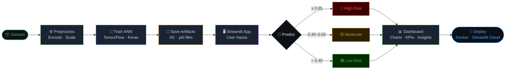

# 🔮 ChurnLens — Customer Churn Prediction Dashboard

> A production-ready, AI-powered customer churn intelligence dashboard built with TensorFlow, Scikit-learn, and Streamlit. Features a modern dark-themed UI with interactive Plotly visualizations and real-time risk classification.

<div align="center">

[](https://ann-classification-customer-churn-model-hqot5dmwoyve3jdtycgt7l.streamlit.app)
[](https://github.com/rnrahate/ANN-Classification-Customer-Churn-Model)
[](https://hub.docker.com/repository/docker/rnrahate/churnlens/general)

</div>

---

## 🗺️ Project Flow



---

## ✨ Features

- **Real-time churn probability** prediction using a trained TensorFlow ANN
- **Interactive Plotly charts** — Gauge, Bar, and Donut visualizations
- **3-tier risk classification** — Low / Moderate / High with color-coded UI
- **Dynamic risk interpretation** with actionable business recommendations
- **Horizontal probability progress bar** with conditional coloring
- **KPI metric cards** — Churn %, Retention %, Risk Level, Model Confidence
- **Expandable advanced panel** — raw & scaled feature vectors, model metadata
- **Sidebar input form** — fully grouped and labeled for UX clarity
- **Custom CSS theming** — dark dashboard aesthetic with Space Mono + DM Sans fonts
- **Session state persistence** — results preserved across widget interactions
- **Cached model loading** — `@st.cache_resource` for fast repeat loads

---

## 🗂 Project Structure

```
churnlens/
│
├── app.py                              # Main Streamlit application
│
├── trained_model/
│   └── churn_model.h5                  # Trained TensorFlow/Keras model
│
├── preprocessing_models/
│   ├── one_hot_encoder_geography.pkl   # OneHotEncoder for Geography
│   ├── label_encoder_gender.pkl        # LabelEncoder for Gender
│   └── scaler_features.pkl            # StandardScaler for all features
│
├── Dockerfile                          # Docker container definition
├── docker-compose.yml                  # Docker Compose config
├── requirements.txt                    # Python dependencies
└── README.md                           # This file
```

---

## ⚙️ Installation & Setup

### 1. Clone the Repository

```bash
git clone https://github.com/rnrahate/ANN-Classification-Customer-Churn-Model.git
cd ANN-Classification-Customer-Churn-Model
```

### 2. Create a Virtual Environment

```bash
python -m venv venv
source venv/bin/activate      # macOS / Linux
venv\Scripts\activate         # Windows
```

### 3. Install & Run

```bash
pip install -r requirements.txt
streamlit run app.py
```

> App opens at **http://localhost:8501**

---

## 🐳 Docker Deployment

```bash
# Pull from Docker Hub
docker pull rnrahate/churnlens:latest
docker run -p 8501:8501 rnrahate/churnlens:latest

# Or build locally
docker compose up --build
```

---

## 🧠 Model & Preprocessing Details

### Input Features

| Feature | Type | Encoding |
|---------|------|----------|
| `CreditScore` | Numeric | StandardScaler |
| `Geography` | Categorical | OneHotEncoder → France / Germany / Spain |
| `Gender` | Categorical | LabelEncoder → 0 / 1 |
| `Age` | Numeric | StandardScaler |
| `Tenure` | Numeric | StandardScaler |
| `Balance` | Numeric | StandardScaler |
| `NumOfProducts` | Numeric | StandardScaler |
| `HasCrCard` | Binary | StandardScaler |
| `IsActiveMember` | Binary | StandardScaler |
| `EstimatedSalary` | Numeric | StandardScaler |

### Feature Order

```python
FEATURE_ORDER = [
    'CreditScore', 'Gender', 'Age', 'Tenure', 'Balance',
    'NumOfProducts', 'HasCrCard', 'IsActiveMember', 'EstimatedSalary',
    'Geography_France', 'Geography_Germany', 'Geography_Spain'
]
```

### Model Architecture

| Property | Value |
|----------|-------|
| Framework | TensorFlow / Keras |
| Output activation | Sigmoid |
| Task | Binary classification |
| Output range | 0.0 → 1.0 |

---

## 🎯 Risk Classification

| Range | Tier | Action |
|-------|------|--------|
| 0–40% | 🟢 Low | Cross-sell / upsell |
| 40–65% | 🟡 Moderate | Light engagement campaign |
| 65–100% | 🔴 High | Immediate retention action |

> Decision boundary **0.50** · Confidence = `|prob − 0.5| / 0.5 × 100%`

---

## 🤝 Contributing

1. Fork → create branch → commit → push → open PR

---

## 📄 License

MIT License — see [LICENSE](LICENSE) for details.

---

## 🙏 Acknowledgements

[Streamlit](https://streamlit.io/) · [TensorFlow](https://www.tensorflow.org/) · [Plotly](https://plotly.com/python/) · [Scikit-learn](https://scikit-learn.org/) · [Churn Dataset](https://www.kaggle.com/datasets/shubh0799/churn-modelling)

---

<div align="center">
  <strong>ChurnLens</strong> · Built with TensorFlow + Streamlit<br>
  <sub>For internal analytical use · Not intended as sole basis for business decisions</sub>
</div>