# 🔮 ChurnLens — Customer Churn Prediction Dashboard

> A production-ready, AI-powered customer churn intelligence dashboard built with TensorFlow, Scikit-learn, and Streamlit. Features a modern dark-themed UI with interactive Plotly visualizations and real-time risk classification.

<div align="center">

[](https://ann-classification-customer-churn-model-hqot5dmwoyve3jdtycgt7l.streamlit.app)
[](https://github.com/rnrahate/ANN-Classification-Customer-Churn-Model)
[](https://hub.docker.com/repository/docker/rnrahate/churnlens/general)

</div>

---

## 📸 Dashboard Preview

```
┌─────────────────────────────────────────────────────────────────────┐
│  🔮 ChurnLens  │  Customer Churn Intelligence Dashboard             │
├──────────────┬──────────────────────────────────────────────────────┤
│              │  [KPI Cards]  Churn % │ Retention % │ Risk │ Conf.  │
│  SIDEBAR     │─────────────────────────────────────────────────────│
│              │  [Gauge Chart] [Bar Chart] [Donut Pie]               │
│  · Geography │─────────────────────────────────────────────────────│
│  · Gender    │  [Feature Table]   [Risk Interpretation Panel]       │
│  · Age       │─────────────────────────────────────────────────────│
│  · Credit    │  ▼ Advanced Details (Expander)                       │
│  · Balance   │    Scaled Feature Vector │ Model Architecture Info   │
│  · Salary    │                                                       │
│  · Tenure    │                                                       │
│  · Products  │                                                       │
│  · Cards     │                                                       │
│              │                                                       │
│  [⚡ Predict] │                                                       │
└──────────────┴──────────────────────────────────────────────────────┘
```

---

## 🗺️ Project Flow

```mermaid
flowchart TD
    A([🗄️ Raw Dataset\nChurn Modelling CSV]) --> B

    subgraph PREPROCESS["⚙️ Preprocessing Pipeline"]
        B[LabelEncoder\nGender → 0 / 1] --> C
        C[OneHotEncoder\nGeography → France / Germany / Spain] --> D
        D[StandardScaler\nNormalise all 12 features]
    end

    D --> E

    subgraph TRAIN["🧠 Model Training"]
        E[ANN Architecture\nInput → Dense → Dropout → Dense → Sigmoid] --> F
        F[Binary Crossentropy Loss\nAdam Optimiser] --> G
        G[Trained Model\nchurn_model.h5]
    end

    G --> H1
    D --> H2

    subgraph ARTIFACTS["💾 Saved Artifacts"]
        H1[churn_model.h5]
        H2[label_encoder_gender.pkl\none_hot_encoder_geography.pkl\nscaler_features.pkl]
    end

    H1 --> I
    H2 --> I

    subgraph APP["🖥️ Streamlit Dashboard — app.py"]
        I[Load Model + Encoders + Scaler\nst.cache_resource] --> J
        J[Sidebar User Inputs\n10 Customer Features] --> K
        K[Preprocessing\nEncode → OHE → Scale] --> L
        L[model.predict\nChurn Probability 0–1] --> M

        subgraph RISK["🎯 Risk Classification"]
            M{Probability\nThreshold}
            M -->|≥ 0.65| N1[🔴 HIGH RISK]
            M -->|0.40–0.65| N2[🟡 MODERATE RISK]
            M -->|< 0.40| N3[🟢 LOW RISK]
        end

        N1 & N2 & N3 --> O

        subgraph VIZ["📊 Visualisations"]
            O[KPI Metric Cards\nChurn % · Retention % · Confidence] --> P
            P[Gauge Chart\nBar Chart\nDonut Pie Chart] --> Q
            Q[Progress Bar\nRisk Badge\nInterpretation Panel]
        end
    end

    Q --> R

    subgraph DEPLOY["🚀 Deployment"]
        R[Docker Build\nDockerfile + docker-compose.yml] --> S
        S[Docker Hub\nrnrahate/churnlens] --> T
        R --> U
        U[Streamlit Cloud\nLive Public App]
    end

    style PREPROCESS fill:#1a2332,stroke:#2ea043,color:#c9d1d9
    style TRAIN fill:#1a2332,stroke:#388bfd,color:#c9d1d9
    style ARTIFACTS fill:#1a2332,stroke:#d29922,color:#c9d1d9
    style APP fill:#1a2332,stroke:#8957e5,color:#c9d1d9
    style RISK fill:#0d1117,stroke:#f85149,color:#c9d1d9
    style VIZ fill:#0d1117,stroke:#3fb950,color:#c9d1d9
    style DEPLOY fill:#1a2332,stroke:#2496ed,color:#c9d1d9

    style A fill:#0d1117,stroke:#2ea043,color:#3fb950
    style G fill:#0d1117,stroke:#388bfd,color:#58a6ff
    style S fill:#0d1117,stroke:#2496ed,color:#58a6ff
    style U fill:#0d1117,stroke:#ff4b4b,color:#ff4b4b
    style N1 fill:#3d0000,stroke:#f85149,color:#f85149
    style N2 fill:#2d2000,stroke:#d29922,color:#d29922
    style N3 fill:#002d00,stroke:#3fb950,color:#3fb950
```



---

## ✨ Features

- **Real-time churn probability** prediction using a trained TensorFlow ANN
- **Interactive Plotly charts** — Gauge, Bar, and Donut visualizations
- **3-tier risk classification** — Low / Moderate / High with color-coded UI
- **Dynamic risk interpretation** with actionable business recommendations
- **Horizontal probability progress bar** with conditional coloring
- **KPI metric cards** — Churn %, Retention %, Risk Level, Model Confidence
- **Expandable advanced panel** — raw & scaled feature vectors, model metadata
- **Sidebar input form** — fully grouped and labeled for UX clarity
- **Custom CSS theming** — dark dashboard aesthetic with Space Mono + DM Sans fonts
- **Session state persistence** — results preserved across widget interactions
- **Cached model loading** — `@st.cache_resource` for fast repeat loads

---

## 🗂 Project Structure

```
churnlens/
│
├── app.py                              # Main Streamlit application
│
├── trained_model/
│   └── churn_model.h5                  # Trained TensorFlow/Keras model
│
├── preprocessing_models/
│   ├── one_hot_encoder_geography.pkl   # OneHotEncoder for Geography
│   ├── label_encoder_gender.pkl        # LabelEncoder for Gender
│   └── scaler_features.pkl            # StandardScaler for all features
│
├── Dockerfile                          # Docker container definition
├── docker-compose.yml                  # Docker Compose config
├── requirements.txt                    # Python dependencies
└── README.md                           # This file
```

---

## ⚙️ Installation & Setup

### 1. Clone the Repository

```bash
git clone https://github.com/rnrahate/ANN-Classification-Customer-Churn-Model.git
cd ANN-Classification-Customer-Churn-Model
```

### 2. Create a Virtual Environment

```bash
python -m venv venv

# macOS / Linux
source venv/bin/activate

# Windows
venv\Scripts\activate
```

### 3. Install Dependencies

```bash
pip install -r requirements.txt
```

### 4. Add Your Model & Preprocessors

Ensure the following files exist in their respective directories before running the app:

| File | Path |
|------|------|
| Keras model | `trained_model/churn_model.h5` |
| OHE encoder | `preprocessing_models/one_hot_encoder_geography.pkl` |
| Label encoder | `preprocessing_models/label_encoder_gender.pkl` |
| Feature scaler | `preprocessing_models/scaler_features.pkl` |

### 5. Run the App

```bash
streamlit run app.py
```

The app will open at **http://localhost:8501**

---

## 🐳 Docker Deployment

### Pull from Docker Hub

```bash
docker pull rnrahate/churnlens:latest
docker run -p 8501:8501 rnrahate/churnlens:latest
```

### Build Locally

```bash
docker build -t churnlens .
docker run -p 8501:8501 churnlens
```

### Using Docker Compose

```bash
docker compose up --build
```

> Access the app at **http://localhost:8501**

---

## 📦 Requirements

```txt
streamlit>=1.32.0
tensorflow>=2.12.0
scikit-learn>=1.3.0
pandas>=2.0.0
numpy>=1.24.0
plotly>=5.18.0
```

---

## 🧠 Model & Preprocessing Details

### Input Features

| Feature | Type | Encoding |
|---------|------|----------|
| `CreditScore` | Numeric | StandardScaler |
| `Geography` | Categorical | OneHotEncoder → France / Germany / Spain |
| `Gender` | Categorical | LabelEncoder → 0 / 1 |
| `Age` | Numeric | StandardScaler |
| `Tenure` | Numeric | StandardScaler |
| `Balance` | Numeric | StandardScaler |
| `NumOfProducts` | Numeric | StandardScaler |
| `HasCrCard` | Binary | StandardScaler |
| `IsActiveMember` | Binary | StandardScaler |
| `EstimatedSalary` | Numeric | StandardScaler |

### Feature Order (must match training pipeline)

```python
FEATURE_ORDER = [
    'CreditScore', 'Gender', 'Age', 'Tenure', 'Balance',
    'NumOfProducts', 'HasCrCard', 'IsActiveMember', 'EstimatedSalary',
    'Geography_France', 'Geography_Germany', 'Geography_Spain'
]
```

> ⚠️ **Important:** This column order must exactly match the order used when fitting the `StandardScaler` during training. Any mismatch will silently produce incorrect predictions.

### Model Architecture

| Property | Value |
|----------|-------|
| Framework | TensorFlow / Keras |
| File format | `.h5` |
| Output activation | Sigmoid |
| Task | Binary classification (churn / no churn) |
| Output range | 0.0 → 1.0 (probability) |

---

## 🎯 Risk Classification

| Probability Range | Risk Tier | UI Color | Recommended Action |
|-------------------|-----------|----------|--------------------|
| 0% – 40% | 🟢 Low Risk | Green `#3fb950` | Cross-sell / upsell opportunities |
| 40% – 65% | 🟡 Moderate Risk | Amber `#d29922` | Light-touch engagement campaigns |
| 65% – 100% | 🔴 High Risk | Red `#f85149` | Immediate retention intervention |

> Decision boundary at **0.50** · Confidence = `|prob − 0.5| / 0.5 × 100%`

---

## 🖥 UI Architecture

| Section | Component | Description |
|---------|-----------|-------------|
| Hero Header | Custom HTML/CSS | App title, subtitle, animated gradient card |
| Sidebar | `st.sidebar` | 10 customer input fields, grouped by category |
| KPI Row | `st.metric` | Churn %, Retention %, Risk Level, Confidence |
| Progress Bar | Custom CSS | Gradient fill driven by probability value |
| Risk Badge | Custom HTML | Color-coded inline badge with tier label |
| Gauge Chart | `plotly.graph_objects` | Indicator with 3-zone arc and threshold line |
| Bar Chart | `plotly.graph_objects` | Churn vs Retention vertical bars |
| Donut Chart | `plotly.graph_objects` | Probability distribution with center annotation |
| Feature Table | Custom HTML | Raw input key-value pairs |
| Interpretation | Custom HTML | Tier-specific business recommendation card |
| Threshold Info | Custom HTML | Pill badges explaining all 3 thresholds |
| Advanced Panel | `st.expander` | Scaled vector, raw features, model metadata |

---

## 🔧 Customization

### Change the Risk Thresholds

```python
if prob >= 0.65:        # ← High risk threshold
    risk_tier = "HIGH"
elif prob >= 0.40:      # ← Medium risk threshold
    risk_tier = "MEDIUM"
else:
    risk_tier = "LOW"
```

### Swap the Color Palette

```python
risk_color = "#f85149"   # High  — change to any hex
risk_color = "#d29922"   # Med   — change to any hex
risk_color = "#3fb950"   # Low   — change to any hex
```

---

## 🤝 Contributing

1. Fork the repository
2. Create a feature branch: `git checkout -b feature/your-feature`
3. Commit your changes: `git commit -m 'Add your feature'`
4. Push to the branch: `git push origin feature/your-feature`
5. Open a Pull Request

---

## 📄 License

This project is licensed under the **MIT License** — see the [LICENSE](LICENSE) file for details.

---

## 🙏 Acknowledgements

- [Streamlit](https://streamlit.io/) — rapid ML app framework
- [TensorFlow / Keras](https://www.tensorflow.org/) — deep learning backend
- [Plotly](https://plotly.com/python/) — interactive chart library
- [Scikit-learn](https://scikit-learn.org/) — preprocessing utilities
- Dataset inspired by the [Churn Modelling Dataset](https://www.kaggle.com/datasets/shubh0799/churn-modelling) on Kaggle

---

<div align="center">
  <strong>ChurnLens</strong> · Built with TensorFlow + Streamlit<br>
  <sub>For internal analytical use · Not intended as sole basis for business decisions</sub>
</div>